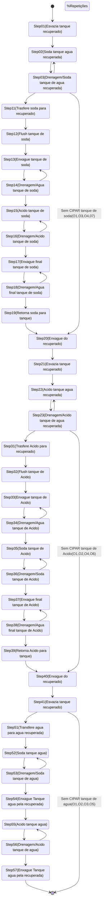

# SID

```mermaid


stateDiagram
    %% Prepararão
    S01: Step01(Esvazia tanque recuperado)
    S02: Step02(Soda tanque agua recuperada)
    S03: Step03(Drenagem/Soda tanque de agua recuperada)

    %% CIP tanque de soda
    S11: Step11(Trasfere soda para recuperado)
    S12: Step12(Flush tanque de soda)
    S13: Step13(Enxague tanque de soda)
    S14: Step14(Drenagem/Agua tanque de soda)
    S15: Step15(Acido tanque de soda)
    S16: Step16(Drenagem/Acido tanque de soda)
    S17: Step17(Enxague final tanque de soda)
    S18: Step18(Drenagem/Agua final tanque de soda)
    S19: Step19(Retorna soda para tanque)
    %%Inicia a preparação tanques soda

    S20: Step20(Enxague do recuperado)
    S21: Step21(Esvazia tanque recuperado)
    S22: Step22(Acido tanque agua recuperada)
    S23: Step23(Drenagem/Acido tanque de agua recuperada)

    %% CIP tanque de Acido
    S31: Step31(Trasfere Acido para recuperado)
    S32: Step32(Flush tanque de Acido)
    S33: Step33(Enxague tanque de Acido)
    S34: Step34(Drenagem/Agua tanque de Acido)
    S35: Step35(Soda tanque de Acido)
    S36: Step36(Drenagem/Soda tanque de Acido)
    S37: Step37(Enxague final tanque de Acido)
    S38: Step38(Drenagem/Agua final tanque de Acido)
    S39: Step39(Retorna Acido para tanque)
    %%Inicia a preparação tanques acido

    S40: Step40(Enxague do recuperado)
    S41: Step41(Esvazia tanque recuperado)

    %%CIP tanque de Agua
    S51: Step51(Transfere agua para agua recuperada)
    S52: Step52(Soda tanque agua)
    S53: Step53(Drenagem/Soda tanque de agua)
    S54: Step54(Enxague Tanque agua pela recuperada)
    S55: Step55(Acido tanque agua)
    S56: Step56(Drenagem/Acido tanque de agua)
    S57: Step57(Enxague Tanque agua pela recuperada)
    %%Inicia a preparação tanques agua

    [*] --> S01
    S01 --> S02 
    S02 --> S03
    S03 --> S02 %Repetições
    S03 --> S11
    S11 --> S12
    S12 --> S13
    S13 --> S14
    S14 --> S13 %Repetições
    S14 --> S15
    S15 --> S16
    S16 --> S15 %Repetições
    S16 --> S17
    S17 --> S18
    S18 --> S17 %Repetições
    S18 --> S19
    S19 --> S20
    S20 --> S21
    S21 --> S22
    S22 --> S23
    S23 --> S22 %Repetições
    S23 --> S31
    S31 --> S32
    S32 --> S33
    S33 --> S34
    S34 --> S33 %Repetições
    S34 --> S35
    S35 --> S36
    S36 --> S35 %Repetições
    S36 --> S37
    S37 --> S38
    S38 --> S37 %Repetições
    S38 --> S39
    S39 --> S40
    S40 --> S41
    S41 --> S51
    S51 --> S52
    S52 --> S53
    S53 --> S52 %Repetições
    S53 --> S54
    S54 --> S55
    S55 --> S56
    S56 --> S55 %Repetições
    S56 --> S57
    S57 --> [*]

    S03 --> S20 : Sem CIPAR tanque de soda(O1,O3,O4,07)
    S23 --> S40 : Sem CIPAR tanque de Acido(O1,O2,O4,O6)
    S41 --> [*] : Sem CIPAR tanque de agua(O1,O2,O3,O5)

```
